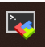
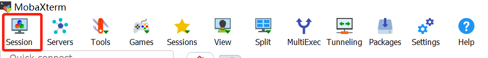
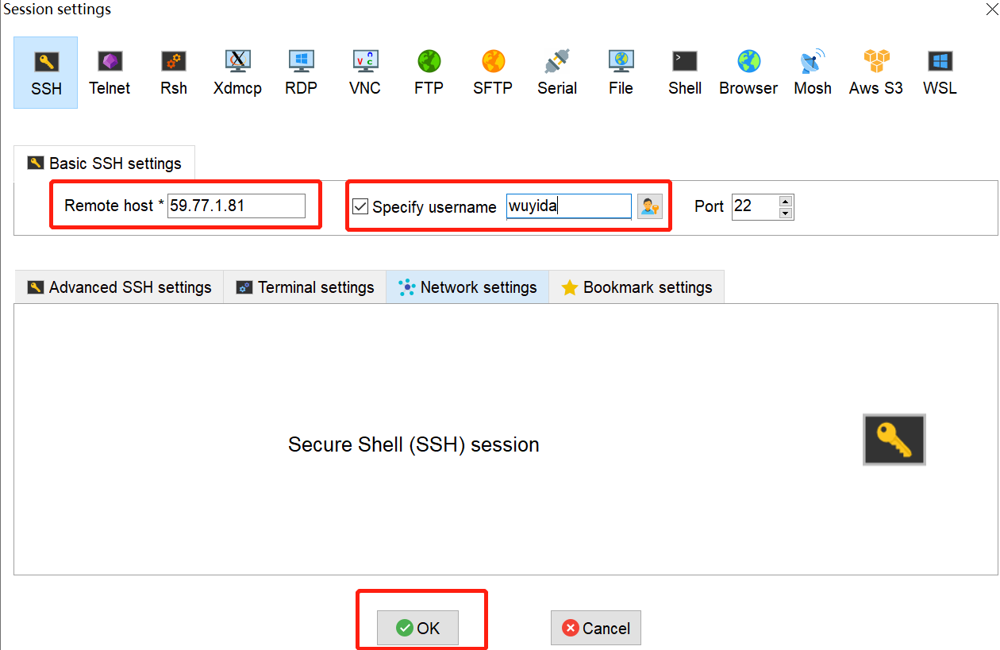
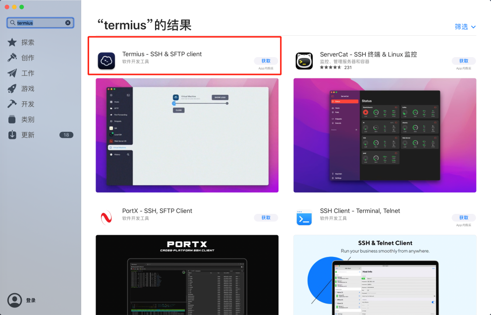

# 1 服务器简介和连接服务器
## 1.1 服务器配置
### 1.1.1 1号服务器
【地址】59.77.1.81

【线程】支持超线程技术，逻辑CPU个数4\*26\*2=208个

【GPU】3 \* Nvidia 2080Ti

【硬盘】非系统盘共6.5T

【内存】1T，不包括交换扇区
### 1.1.2 2号服务器（集群）
【地址】59.77.1.83

【线程】支持超线程技术，逻辑CPU个数152\*2=304个

【硬盘】非系统盘共3.9T

【内存】750G+750G，不包括交换扇区

## 1.2 网络设置
### 1.2.1 厦大内网

- 当连接无线网络**XMUNET+**（教室、实验楼、食堂）或**MATH**（自习室、办公室）时，可以直接连接服务器。

- 若使用**XMUNET+**，其密码可在[WIFI密码修改重置](http://pass.xmu.edu.cn/)设置。

- 若使用**MATH**，其密码请询问服务器管理员。

### 1.2.2 非厦大内网（需连接VPN）

- 当所使用的网络不是厦大内网时（如在宿舍、假期在家），同学们需要连接VPN才能连接服务器，VPN使用见参考[VPN仅支持厦门大学企业微信APP扫码登录的通知](https://open.work.weixin.qq.com/wwopen/mpnews?mixuin=zdCnDQAABwB7HS1PAAAUAA&mfid=WW0305-MbyB5QAABwCBWYpWLBj5NAwUdgs65&idx=0&sn=60fa72b001663906c6da6a7a59e3b335)。

## 1.3 进入服务器终端
### 1.3.1 通过软件进入——MobaXterm（Win端）

（1）在个人电脑上安装**MobaXterm**（[下载地址](https://mobaxterm.mobatek.net/download.html)）

（2）点击左上角**Session**后，在弹出的窗口中点击第一个**SSH**

（3）在窗口中输入**服务器地址（如1号服务器：59.77.1.81）**和**用户名**后，确认无误后点击OK

（4）进入服务器界面后需要输入密码。**注意，输入密码时是没有任何显示的**，所以一定要小心谨慎地输入。输入后回车即可。（输错三次会锁10分钟，必要时可以联系管理员解锁）

（5）当看到下面的界面时，说明已经成功连接服务器

（6）此后除非修改密码，否则登录时无需再输入密码，**只需在MobaXterm首页点击自己的用户名进入即可**

### 1.3.2 通过软件进入——Termius（Mac端）

（1）在个人电脑上安装**Termius**，Mac用户直接在Apple Store搜索即可

（2）下载后完成设置和创建账户（与服务器账户无关）

（3）在相应窗口输入**服务器地址（如1号服务器：59.77.1.81），点击Create host**

（4）在右侧的信息栏输入**用户名（向服务器管理员申请）和密码**，确认无误后双击中间的地址后进入服务器终端

（5）若显示以下界面，说明已经成功进入服务器终端

