# 3 PBS程序提交系统

本节介绍的**PBS程序提交系统**，是许多同学调用CPU跑程序的一个排队系统（同学们的程序任务相当于顾客，服务器的核相当于服务员，程序所运行的时间相当于服务时间）。

**提交PBS系统有两个好处：**

1. 同学们提交完程序并确保程序已经开始运行的情况下，可以退出服务器终端去完成其它事情（包括关闭个人电脑），此时程序会继续跑，直至程序完成或达到所设的最长时限。
2. PBS系统可以保证服务器有序地分配计算资源给使用者，在资源有限时，优先分配资源给先提交程序者A，此时后提交者B提交程序会处于排队状态。只有等先提交者A的程序运行完成后才会分配资源给后提交者B。**如果A或B使用命令行提交程序，计算资源将会轮流分配给A和B，这样两人的执行时间都将延长**。

## 3.1 PBS系统基本命令
在使用PBS系统时，会涉及一些常用的命令，包含**查看、提交、删除**等功能。

| **命令** | **功能** |
| --- | --- |
| `qstat` | 查看PBS系统正在运行以及排队的任务 |
| `qstat -r` | 查看PBS系统正在运行以及排队的任务使用的节点数和核数 |
| `qstat |grep user` | 查看user这个用户的所有任务情况 |
| `pbsnodes -a` | 查看PBS系统是否空闲 |
| `qsub 脚本文件` | 提交任务 |
| `qdel 任务序号` | 删除单个任务 |
| `qdel {始序号..末序号}`  | 删除批量任务 |

## 3.2 调用CPU运行编程程序 

在提交程序之前，首先在命令行中输入下面的命令，可以查看相应服务器**当前被使用的核数**

| **服务器** | **命令** |**上限**|
| --- | --- | --- |
| 81服务器 | `qstat -n |grep -wo "statml-0" |wc -l` | 208 |
| 83服务器的stat1-0节点 | `qstat -n |grep -wo "stat1-0" |wc -l` | 152 |
| 83服务器的stat2-0节点 | `qstat -n |grep -wo "stat2-0" |wc -l` | 152 |

如果显示的数字没有达到**上限**，则可以提交程序，否则，先不提交程序，防止PBS系统崩溃。

在下面的小节中，我们会介绍**R语言、Matlab以及Python**三种类型代码的提交，同学们可以根据需求直接看相应的小节。

### 3.2.1 R语言（附示例）
#### （一）版本说明

R语言版本：4.1.3（2022-03-10）

**提醒**  如果同学们发现该R语言版本满足不了自己的需求，可以自行在自己的账户下安装合适的R语言版本，或者参考[第4节服务器环境配置](https://statserver.readthedocs.io/zh/latest/raw/服务器使用基本教程/CH4服务器环境配置.html)使用miniconda管理自己的R环境。

#### （二）R包的安装

（1）键入`R`回车后进入R语言环境；

（2）使用`install.packages()`命令安装R包，回车后稍等片刻会弹出镜像选择窗口，选择后确认即可；

**提醒**  如果出现**grab failed: window not viewable** 的报错，意思是镜像选择窗口抓取失败，可以在R环境下输入`chooseCRANmirror(graphics=FALSE)` ，此后再执行`install.packages()`就不会出现窗口，而是通过输入镜像对应的序号选择特定的镜像地址。

（3）安装后的R包会存在自己用户的一个子目录下，使用`library()`查看是否报错，若无，R包安装完成；

（4）输入`q()`或者`CTRL+C`退出R界面。

#### （三）单核任务提交方法：PBS脚本

（1）将要运行的R代码拖入到服务器目录中；

（2）进入R代码所在目录，使用文本编辑器`vim`编写任务脚本；

（3）使用`qsub`命令提交任务。

**示例**

（1）准备好要运行的R脚本（**test1.R**），该代码的功能是生成1000个标准正态分布的随机数并计算样本均值，最后将均值保存为.R文件。
```{r}
set.seed(202209) # 设定随机种子，保证模拟可以复现，非常重要！
a = rnorm(1000,0,1)
a_mean = mean(a)
setwd("/project1/wuyida/R/test") # 设置文件要保存的路径
save(a_mean,file="a_mean.R")
```

（2）将**test1.R**拖入到服务器的目录中，如/project1/wuyida/R/test/。

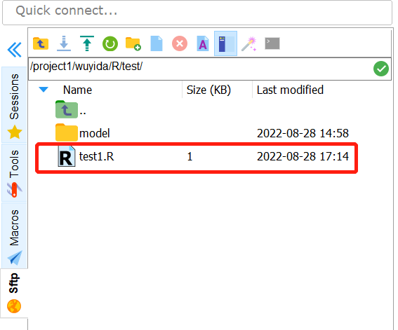

（3）使用命令行`cd /project1/wuyida/R/test/`进入该目录，使用文本编辑器`vim test`（见2.3节）编写任务脚本**test**（test这个名字可以任意更改），**test**的内容如下所示。

**同学们可以直接将下面的脚本复制后，使用鼠标右键（ctrl+v不行）将其直接粘贴到test的文本编辑界面修改，再保存退出。**

```
#!/bin/sh
#PBS -l nodes=1:ppn=1          
#PBS -l walltime=30000:00:00       
#PBS -o routput                   
#PBS -e rerror
#PBS -m abe
#PBS -M example@xxx.xx 
cd $PBS_O_WORKDIR
/usr/local/bin/R < test1.R --save
```
**注释** （一般来说，只需修改加粗的行）

- 第一行：指此脚本使用/bin/sh来解释执行；
- 第二行：设置程序所需要的资源，nodes代表节点数，ppn代表核数，这里两者均设为1；
- 第三行：设置程序最长运行时间；
- 第四行：设置程序的输出结果文件名称（与脚本文件在同一个目录下）；
- 第五行：设置程序的错误提示的文件名称（与脚本文件在同一个目录下），用户可以在这个文件内查看任务的报错信息；
- **第六、七行**：设置任务完成自动发送邮箱提醒功能，同学们可以根据自身需要选择这两行是否保留。若保留，则修改第七行的邮箱，若不需要，则把这两行删掉即可；
- 第八行：进入执行命令的工作目录；
- **第九行**：/usr/local/bin/R是R语言所在的路径（如果使用的是自己安装的R，要更改这个路径，Linux中可以使用`which R`查看），test1.R是待执行的R代码文件。文件名称根据实际修改，后面的`--save`要保留不能删除。

（4）使用`qsub test`命令提交程序，使用`qstat`查看任务进程。

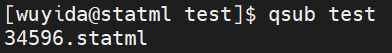

**注释**  34596是任务序号，statml是81服务器的主机名。


**注释**  任务序号34596，任务名test，所有者wuyida，运行时间00:00:00，运行状态C（C表示完成或者终止，R表示正在运行，Q表示排队），81服务器队列代号是batch。

（5）使用`ls`查看结果文件。

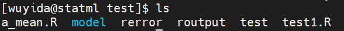

**注释**  可以看到结果文件**routput**和错误文件**rerror**均出现在该目录下，同时也可以看到，我们的测试代码里面保存的**a_mean.R**文件也出现在该目录下。

**提醒**  如果有多段相同功能的代码需要运行，可以使用编程语言批量生成多组脚本（单核PBS脚本+代码脚本）后一次性提交，下面会提供Perl脚本的示例，同学们也可以使用python、shell等语言实现相同的功能。

到此，任务实现完毕。

#### （四）多核任务提交方法一：Perl脚本

**功能实现：执行K次模拟，各次模拟执行相同的功能，且之间相互独立，互不干扰。**

本方法是借助**Perl**批量生成多个模拟任务各自对应的PBS脚本并一次性提交，步骤如下：

（1）在要执行的R代码中加入相应的头文件；

（2）将R代码和Perl脚本拖入到服务器目录中；

（3）使用Perl脚本提交任务；

**示例**

（1）准备好要运行的R脚本（**test2.R**），该代码的功能是抽取K组10000个标准正态分布的随机数并计算各自的样本均值，最后将这些均值保存为.R文件。【注意：此为示例代码，实际中实现此功能完全不需要用多个核跑】
```{r}
args=commandArgs(T);
jobB=args[1];
jobE=args[2];
DirPre=args[3];
n = 10000
for(p in jobB:jobE){
  set.seed(p)
  temp = mean(rnorm(n,0,1))
  save(temp,file = paste("mean_",p,".R",sep="")) 
}
```
**提醒**

- 前4行内容为perl头文件，需要复制到你要执行的R代码的**最上方**；
- 循环次数需要更改为**jobB:jobE**，每一次循环就是一次模拟实验。

（2）将**test2.R**和**qsub_r.pl**拖入到服务器的目录中，如/project1/wuyida/R/test/。


[qsub_r.pl文件下载地址](https://pan.baidu.com/s/1OFqZSCCHLb1jGSXgRbmbCA) 

提取码：3olg 

（3）进入/project1/wuyida/R/test/，使用perl命令提交代码，**在这里你需要设置调用多少个核以及每个核的运算次数**。
```perl
perl ./qsub_r.pl /project1/wuyida/R/test test_ 1 5 20 /project1/wuyida/R/test Rscript test2.R
```
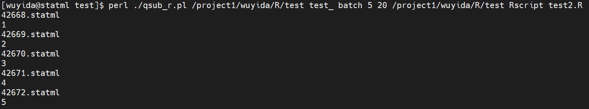

**注释**

- `perl ./qsub_r.pl` 调用perl执行qsub_r.pl文件，`./`是执行的意思，**均不用改动**；
- `/project1/wuyida/R/test`是任务文件（.job/.err/.out）的输出路径，以及你的代码保存文件的默认输出路径（建议在R代码里设好保存路径）；`test_`是任务的前缀名；`1`指节点数（**不用改动**）；`5`指调用5个核，`20`指每个核计算20次，所以这里相当于调用5个核执行100次循环，对应于for循环的1-100。如果想要改变循环的起点和终点，可以在 R 代码的for循环部分添加一个常数。**这一部分除了节点数，其它根据实际修改**；
- `/project1/wuyida/R/test` 作业运行的工作目录，一般和前面的工作目录保持一致即可；
-  `Rscript test2.R` 调用Rscript运行test2.R文件，**代码文件名根据实际修改**。

（4）使用`qstat`查看任务运行情况


**注释** 一个核的运行对应一个任务，42668-42672是这五个任务对应的编号。运行时间00:00:00，（C表示完成或者终止，R表示正在运行，Q表示排队），服务器队列代号是batch。

（5）可以看到5个任务（共100次模拟）对应的结果文件（100个均值）都在/project1/wuyida/R/test/中。

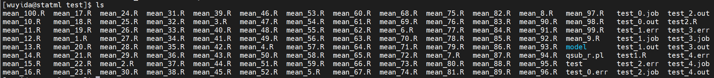

到此，任务实现完毕。

#### （五）多核任务提交方法二：结合R并行计算代码
**功能实现：待执行任务的某步骤可以分解成K个独立个体单独计算再合并，充分利用计算资源。（在有些情况下与方法一等同）**

（1）将要运行的**有使用并行计算代码的R代码**拖入到服务器目录中；

（2）进入R代码所在目录，使用文本编辑器`vim`编写任务脚本；

（3）使用`qsub`命令提交任务。

**提醒**  多核任务提交与单核任务提交的步骤一样，不同的是R代码需要加入并行代码以及任务脚本需要指定使用多少个核。

**示例**

（1）准备好要运行的R脚本（**test1.R**），该代码的功能是调用5个核抽100组10000个标准正态分布的随机数并计算各自的样本均值，最后将100个均值保存为.R文件。【注意：此为示例代码，实际中实现此功能完全不需要并行】
```r
set.seed(202209) # 设定随机种子，保证模拟可以复现，非常重要！
library(snowfall) # 调用实现并行的包
K = 100 # 实验次数
sfInit(parallel = TRUE, cpus = 5) # 设置使用的CPU核数，必须能整除K
single_fun = function(index,n){
  temp = rnorm(n,0,1)
  return(mean(temp))
  }
allmean = sfSapply(1:K,single_fun,n=10000) # 调用5个核计算K个实验，在这个例子中，每个核执行20个实验
sfStop() # 停止并行
setwd("/project1/wuyida/R/test") # 设置文件要保存的路径
save(allmean,file="allmean.R")
```
**提醒**  上述代码中并行代码调用的是snowfall包，这部分是可以替换的。R语言中实现并行计算的包，如parallel、snowfall等（[HighPerformanceComputing](https://cran.r-project.org/web/views/HighPerformanceComputing.html)），不同的包有各自的有优缺点。具体如何使用同学们可以上网查找如何使用。


（2）将**test1.R**拖入到服务器的目录中，如/project1/wuyida/R/test/。


（3）使用命令行`cd /project1/wuyida/R/test/`进入该目录，使用文本编辑器`vim test`（见2.3节）编写任务脚本**test**（test这个名字可以任意更改），**test**的内容如下所示。
**同学们可以直接将下面的脚本复制后使用鼠标右键（ctrl+v不行）将其直接粘贴到test的文本编辑界面修改，再保存退出。**

（4）粘贴到test的文本编辑界面，再保存退出。
```
#!/bin/sh
#PBS -l nodes=1:ppn=5         
#PBS -l walltime=30000:00:00       
#PBS -o routput                   
#PBS -e rerror
#PBS -m abe
#PBS -M example@xxx.xx 
cd $PBS_O_WORKDIR
/usr/local/bin/R < test1.R --save
```

**注释** （一般来说，只需修改加粗的行）

- 第一行：指此脚本使用/bin/sh来解释执行；
- **第二行**：设置程序所需要的资源，nodes代表节点数，ppn代表核数，这里调用了5个核。注意81服务器的nodes默认为1，不需要改动，只需修改ppn为你实际所调用的核数。83服务器有两个节点，所以使用时需要指定nodes=stat1-0或nodes=stat2-0，同时设定相应的ppn；
- 第三行：设置程序最长运行时间；
- 第四行：设置程序的输出结果文件名称（与脚本文件在同一个目录下）；
- 第五行：设置程序的错误提示的文件名称（与脚本文件在同一个目录下），用户可以在这个文件内查看任务的报错信息；
- **第六、七行**：设置任务完成自动发送邮箱提醒功能，同学们可以根据自身需要选择这两行是否保留。若保留，则修改第七行的邮箱，若不需要，则把这两行删掉即可；
- 第八行：进入执行命令的工作目录；
- **第九行**：/usr/local/bin/R是R语言所在的路径（如果使用的是自己安装的R，要更改这个路径，Linux中可以使用`which R`查看），test1.R是待执行的R代码文件，文件名称根据实际修改，后面的`--save`要保留不能删除。


（5）使用`qsub test`命令提交程序，使用`qstat`查看任务进程。


**注释**  34905是任务序号，statml是81服务器的主机名。


**注释**  任务序号34905，任务名test，所有者wuyida，运行时间00:00:00，（C表示完成或者终止，R表示正在运行，Q表示排队），服务器队列代号是batch。

（6）使用`ls`查看结果文件。

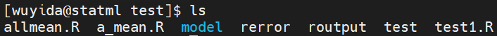

**注释**  可以看到结果文件**routput**和错误文件**rerror**均出现在该目录下，同时也可以看到，**我们的测试代码里面保存的allmean.R文件也出现在该目录下**。

到此，任务实现完毕。

### 3.2.2 Matlab（附示例）
#### （一）版本说明及许可证绑定

81服务器Matlab版本：R2021a

**首次通过服务器进入Matlab需要绑定许可证**，具体步骤如下：

（1）在命令行键入`matlab`，稍等片刻会弹出窗口如下，点击使用Internet自动激活后点击下一步。


（2）点击第一个登录到我的账户，输入自己已激活的MathWorks账号密码，并一直点击下一步，直至完成。若账户此前未激活，请点击[这里](http://zhengban.xmu.edu.cn/matlab.html)查看厦门大学学生激活步骤。


（3）绑定完成后在命令行输入`matlab`，稍等片刻可以看到和自己个人电脑完全一样的界面。

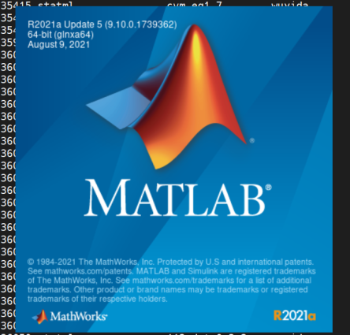


（4）点击关闭，下面提交程序时我们无须打开这个界面。

#### （二）单核任务提交方法：PBS脚本

（1）将要运行的Matlab代码拖入到服务器目录中；

（2）进入Matlab代码所在目录，使用文本编辑器`vim`编写任务脚本；

（3）使用`qsub`命令提交任务。

**示例**

（1）准备好要运行的Matlab脚本（**test1.m**），该代码的功能是生成1000个标准正态分布的随机数并计算样本均值，最后将均值保存为.m文件。
```matlab
rng(202209); # 设定随机种子，保证模拟可以复现，非常重要！
n = 1000;
x = randn(n,1);
mean_x = mean(x);
result_table1=table(mean_x);
cd /project1/wuyida/matlab/test; # 设置文件要保存的路径
writetable(result_table1, 'test1.csv');
```

（2）将**test1.m**拖入到服务器的目录中，如/project1/wuyida/matlab/test/。


（3）使用命令行`cd /project1/wuyida/matlab/test/`进入该目录，使用文本编辑器`vim test`（见2.3节）编写任务脚本**test**（test这个名字可以任意更改），**test**的内容如下所示。
**同学们可以直接将下面的脚本复制后使用鼠标右键（ctrl+v不行）将其直接粘贴到test的文本编辑界面修改，再保存退出。**
```
#!/bin/sh
#PBS -l nodes=1:ppn=1          
#PBS -l walltime=30000:00:00       
#PBS -o routput                   
#PBS -e rerror    
#PBS -m abe
#PBS -M example@xxx.xx 
cd $PBS_O_WORKDIR
/usr/local/bin/matlab < test1.m
```
**注释** （一般来说，只需修改加粗的行）

- 第一行：指此脚本使用/bin/sh来解释执行；
- 第二行：设置程序所需要的资源，nodes代表节点数，ppn代表核数，这里两者均设为1；
- 第三行：设置程序最长运行时间；
- 第四行：设置程序的输出结果文件名称（与脚本文件在同一个目录下）；
- 第五行：设置程序的错误提示的文件名称（与脚本文件在同一个目录下），用户可以在这个文件内查看任务的报错信息；
- **第六、七行**：设置任务完成自动发送邮箱提醒功能，同学们可以根据自身需要选择这两行是否保留。若保留，则修改第七行的邮箱，若不需要，则把这两行删掉即可；
- 第八行：进入执行命令的工作目录；
- **第九行**：/usr/local/bin/matlab是Matlab所在的路径（Linux中可以使用`which matlab`查看），test1.m是待执行的Matlab代码文件，文件名称根据实际修改。

（4）使用`qsub test`命令提交程序，使用`qstat`查看任务进程。

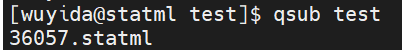

**注释**  36057是任务序号，statml是81服务器的主机名。


**注释**  任务序号36057，任务名test，所有者wuyida，运行时间00:00:00，（C表示完成或者终止，R表示正在运行，Q表示排队），服务器队列代号是batch。

（5）使用`ls`查看结果文件。

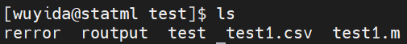

**注释**  可以看到结果文件**routput**和错误文件**rerror**均出现在该目录下，同时也可以看到，**我们的测试代码里面保存的test1.csv文件也出现在该目录下**。

**提醒**  如果有多段相同功能的代码需要运行，可以使用编程语言批量生成多组脚本（单核PBS脚本+代码脚本）后一次性提交，同学们可以使用python、shell、perl等语言实现此功能。

到此，任务实现完毕

#### （三）多核任务提交方法一：结合Matlab并行计算代码

**功能实现：待执行任务的某步骤可以分解成K个独立个体单独计算再合并，充分利用计算资源。（在有些情况下与方法一等同）**

（1）将要运行的**有使用并行计算代码的matlab代码**拖入到服务器目录中；

（2）进入matlab代码所在目录，使用文本编辑器`vim`编写任务脚本；

（3）使用`qsub`命令提交任务。

**提醒**  多核任务提交与单核任务提交的步骤一样，不同的是matlab代码需要加入并行代码 以及 任务脚本需要指定使用多少个核。


**示例**

（1）准备好要运行的R脚本（**test1.m**），该代码的功能是调用5个核抽100组10000个标准正态分布的随机数并计算各自的样本均值，最后将100个均值保存为.csv文件。【注意：此为示例代码，实际中实现此功能完全不需要并行】
```matlab
rng(202209);
p = parpool(5); %开启进程池，指定线程数量为5个
data = zeros(100,1);
parfor i = 1:100 %使用parfor替代for，启用并行。在这个例子中，每个核执行20次运算
n = 10000;
x = randn(n,1);
data(i) = mean(x);
end
delete(p);
result_table1=table(data);
cd /project1/wuyida/matlab/test;
writetable(result_table1, 'test2.csv');
```
**提醒**  上述代码中并行代码使用的是`parfor`框架，除了开启和关闭进程池，其余和for循环使用的语法一样（只需要将`for`替换为`parfor`），注意这里for循环的每一个任务要相互独立，互不影响。


（2）将**test2.m**拖入到服务器的目录中，如/project1/wuyida/matlab/test/。


（3）使用命令行`cd /project1/wuyida/matlab/test/`进入该目录，使用文本编辑器`vim test`（见2.3节）编写任务脚本**test**（test这个名字可以任意更改），**test**的内容如下所示。
**同学们可以直接将下面的脚本复制后使用鼠标右键（ctrl+v不行）将其直接粘贴到test的文本编辑界面修改，再保存退出。**
```
#!/bin/sh
#PBS -l nodes=1:ppn=5           
#PBS -l walltime=30000:00:00       
#PBS -o routput                   
#PBS -e rerror  
#PBS -m abe
#PBS -M example@xxx.xx 
cd $PBS_O_WORKDIR
/usr/local/bin/matlab < test2.m
```
**注释** （一般来说，只需修改加粗的行）

- 第一行：指此脚本使用/bin/sh来解释执行；
- **第二行**：设置程序所需要的资源，nodes代表节点数，ppn代表核数，这里调用了5个核。注意81服务器的nodes默认为1，不需要改动，只需修改ppn为你实际所调用的核数。83服务器有两个节点，所以使用时需要指定nodes=stat1-0或nodes=stat2-0，同时设定相应的ppn；
- 第三行：设置程序最长运行时间；
- 第四行：设置程序的输出结果文件名称（与脚本文件在同一个目录下）；
- 第五行：设置程序的错误提示的文件名称（与脚本文件在同一个目录下），用户可以在这个文件内查看任务的报错信息；
- **第六、七行**：设置任务完成自动发送邮箱提醒功能，同学们可以根据自身需要选择这两行是否保留。若保留，则修改第七行的邮箱，若不需要，则把这两行删掉即可；
- 第八行：进入执行命令的工作目录；
- **第九行**：/usr/local/bin/matlab是matlab所在的路径（Linux中可以使用`which matlab`查看），test2.m是待执行的Matlab代码文件，文件名称根据实际修改。


（4）使用`qsub test`命令提交程序，使用`qstat`查看任务进程。


**注释**  36058是任务序号，statml是81服务器的主机名。


**注释**  任务序号36058，任务名test，所有者wuyida，运行时间00:00:00，（C表示完成或者终止，R表示正在运行，Q表示排队），81服务器队列代号是batch。

（5）使用`ls`查看结果文件。

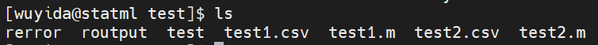

**注释**  可以看到结果文件**routput**和错误文件**rerror**均出现在该目录下，同时也可以看到，**我们的测试代码里面保存的test2.csv文件也出现在该目录下**。

到此，任务实现完毕。

### 3.2.3 Python（附示例）

#### （一）版本说明

服务器Python版本：3.7.0（2018）

**提醒**  推荐同学们参见[第4节服务器环境配置](https://statserver.readthedocs.io/zh/latest/raw/服务器使用基本教程/CH4服务器环境配置.html)
在自己的个人账户下安装miniconda，用其来管理自己的python环境和安装包更方便。如果不安装miniconda，安装python的包可以直接在命令行里用`pip`安装。

#### （二）单核任务提交方法：PBS脚本

（1）将要运行的python代码拖入到服务器目录中；

（2）进入python代码所在目录，使用文本编辑器`vim`编写任务脚本；

（3）使用`qsub`命令提交任务。

**示例**

（1）准备好要运行的python脚本（**test1.py**），该代码的功能是生成1000个标准正态分布的随机数，最后将所有随机数保存为.csv文件。
```python
import os
import pandas as pd
import numpy as np
import scipy.stats as st
np.random.seed(202209) 
a=st.norm.rvs(size=100)
dataframe = pd.DataFrame({'a':a})
os.chdir("/project1/wuyida/python/test")
dataframe.to_csv("test1.csv", sep=',')
```

（2）将**test1.py**拖入到服务器的目录中，如/project1/wuyida/python/test/。


（3）使用命令行`cd /project1/wuyida/python/test/`进入该目录，使用文本编辑器`vim test`（见2.3节）编写任务脚本**test**（test这个名字可以任意更改），**test**的内容如下所示。
**同学们可以直接将下面的脚本复制后使用鼠标右键（ctrl+v不行）将其直接粘贴到test的文本编辑界面修改，再保存退出。**
```
#!/bin/sh
#PBS -l nodes=1:ppn=1          
#PBS -l walltime=30000:00:00       
#PBS -o routput                   
#PBS -e rerror
#PBS -m abe
#PBS -M example@xxx.xx 
cd $PBS_O_WORKDIR
/var/lib/anaconda3/bin/python3 < test1.py
```
**注释** （一般来说，只需修改加粗的行）

- 第一行：指此脚本使用/bin/sh来解释执行；
- 第二行：设置程序所需要的资源，nodes代表节点数，ppn代表核数，这里两者均设为1；
- 第三行：设置程序最长运行时间；
- 第四行：设置程序的输出结果文件名称（与脚本文件在同一个目录下）；
- 第五行：设置程序的错误提示的文件名称（与脚本文件在同一个目录下），用户可以在这个文件内查看任务的报错信息；
- **第六、七行**：设置任务完成自动发送邮箱提醒功能，同学们可以根据自身需要选择这两行是否保留。若保留，则修改第七行的邮箱，若不需要，则把这两行删掉即可；
- 第八行：进入执行命令的工作目录；
- **第九行**：/var/lib/anaconda3/bin/python3是python3所在的路径（如果使用的是自己安装的python，要更改这个路径，Linux中可以使用`which python3`查看），test1.py是待执行的python代码文件，文件名称根据实际修改。

（4）使用`qsub test`命令提交程序，使用`qstat`查看任务进程。

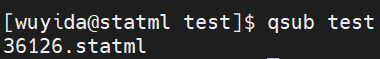

**注释** 36126是任务序号，statml是81服务器的主机名。


**注释** 任务序号36126，任务名test，所有者wuyida，运行时间00:00:00，（C表示完成或者终止，R表示正在运行，Q表示排队），81服务器队列代号是batch。

（5）使用`ls`查看结果文件。


**注释**  可以看到结果文件**routput**和错误文件**rerror**均出现在该目录下，同时也可以看到，**我们的测试代码里面保存的test1.csv文件也出现在该目录下**。

**提醒**  如果有多段相同功能的代码需要运行，可以使用编程语言批量生成多组脚本（单核PBS脚本+代码脚本）后一次性提交，同学们可以使用python、shell、perl等语言实现此功能。

到此，任务实现完毕。

## 3.3 使用83服务器的特别说明

由于83服务器搭建了集群（有2个节点：stat1-0和stat2-0，每个节点各有152个核），所以在使用PBS系统时有以下细节需要注意。

### 3.3.1 PBS脚本需指定节点

如果同学们使用到3.2节中提到的编写PBS任务脚本提交任务，比如下面这个脚本，需要做一点修改。

```
#!/bin/sh
#PBS -l nodes=1:ppn=1          
#PBS -l walltime=30000:00:00       
#PBS -o routput                   
#PBS -e rerror
#PBS -m abe
#PBS -M example@xxx.xx 
cd $PBS_O_WORKDIR
/usr/local/bin/R < test1.R --save
```

在这个脚本中，需要将第二行`nodes=1`改成`nodes=stat1-0`或者`nodes=stat2-0`，具体使用哪个节点管理员会告知。

### 3.3.2 使用perl脚本提交R代码

[qsub_r.pl文件下载地址](https://pan.baidu.com/s/1OFqZSCCHLb1jGSXgRbmbCA)，提取码：3olg 。当使用3.2.1中的perl脚本提交R代码时，同样需要将节点数更改为具体的节点名，如以下示例代码的`stat1-0`，或改为`stat2-0`。其它地方与81服务器一致。
```
perl ./qsub_r.pl /data/wuyida/R test_perl_ stat1-0 5 1 /data/wuyida/R Rscript test.R
```

### 3.3.3 如何查看各个节点的使用情况

使用命令`qstat -n`可以看到`stat1-0`和`stat2-0`的任务情况，如图所示。

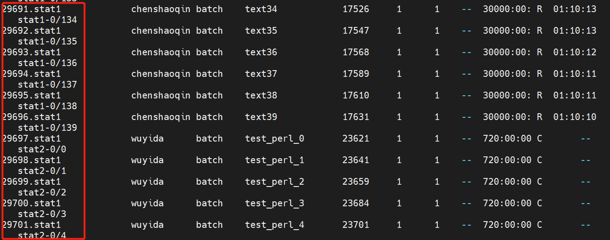

更具体的，可以使用下面的命令查看具体的节点已经被占用的核数。

| **服务器** | **命令** |**上限**|
| --- | --- | --- |
| 83服务器的stat1-0节点 | `qstat -n |grep -wo "stat1-0" |wc -l` | 152 |
| 83服务器的stat2-0节点 | `qstat -n |grep -wo "stat2-0" |wc -l` | 152 |

