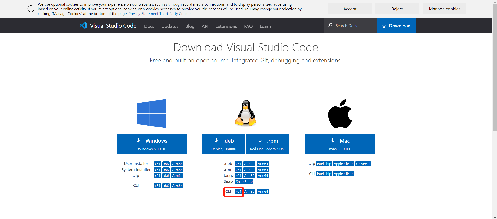
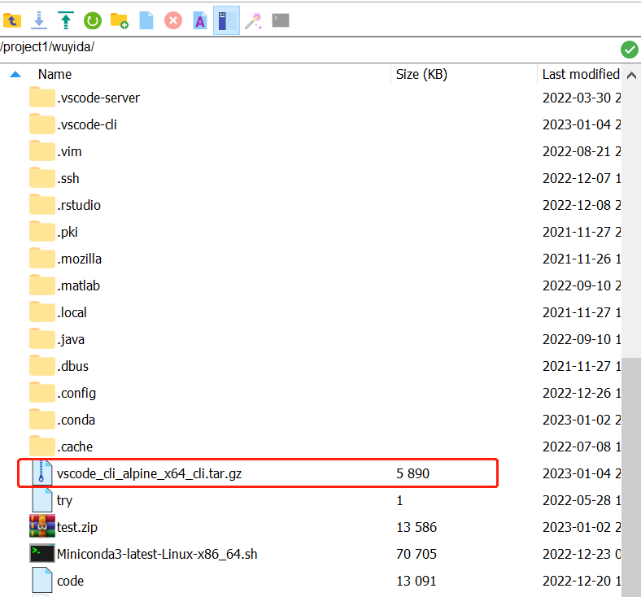

# 2 校外免VPN连接服务器

在这一节我们将给出使用vscode的**remote tunnel**免VPN连接校内服务器的教程，附[参考链接](https://code.visualstudio.com/docs/remote/tunnels)。

## 2.1 准备工作

在设置之前，你需要准备好以下工具：
- 创建一个Github账户，[Github官网](https://github.com/)
- 校外VPN连接软件（校内环境可不用）
- 终端软件如MobaXterm
- 能连上Github的网络

## 2.2 安装配置

（1）下载CLI并将压缩包拖到服务器目录

在[官网](https://code.visualstudio.com/Download#)下载Linux版本的CLI x64（如图），下载后将压缩包vscode_cli_alpine_x64_cli.tar.gz拖到服务器你的个人目录下。





(2) 解压压缩包

确保你此时处于压缩包所在目录，使用命令解压，解压后会出来**code**。
```
tar -zxvf vscode_cli_alpine_x64_cli.tar.gz
```

（3）根据提示完成配置

在命令行输入：
```
./code tunnel
```

紧接着会出现是否同意协议的问题，输入`yes`即可。

稍等片刻会出现

