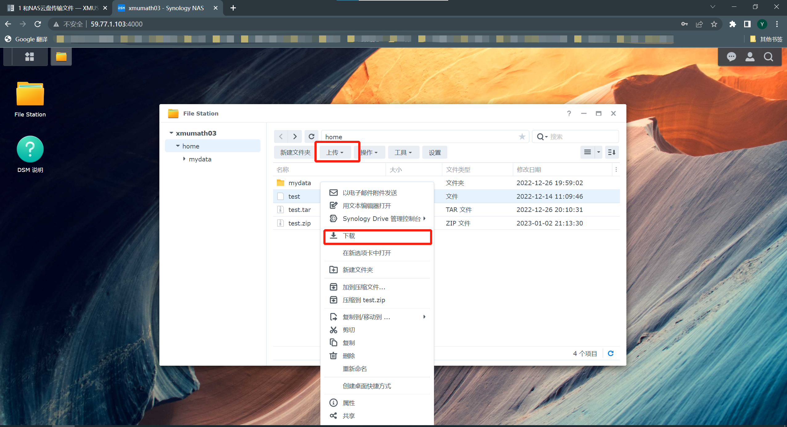

# 1 和NAS云盘传输文件

使用该功能前请先向管理员申请NAS云盘账号，具体见账号创建。

## 1.1 从服务器上传文件至NAS云盘

（1）准备好要上传的文件

**注意** 如果要上传的是单个文件或者同种类型的文件，直接进入（2）；如果是要将整个文件夹的文件上传，需要先将文件夹进行压缩，如这里将**test**文件夹压缩为**test.zip**。

```
zip -r test.zip /project1/wuyida/R/test

#-r将指定的目录下的所有子目录以及文件一起处理
#test.zip 压缩后的文件名
#/project1/wuyida/R/test 待处理的文件夹绝对路径，如果待压缩的文件夹在当前目录下，直接写文件夹名即可
```

（2）连接NAS云盘账户

```
lftp wuyida@59.77.1.103

#只需要将wuyida修改为你的NAS云盘用户名
```

键入上述命令后需要输入NAS云盘账户的密码（输入密码时没有显示），当出现下图时说明已经成功连接NAS账户。


连接NAS账户后需要明确两个路径，本地路径指的是服务器路径，远程路径指的是NAS云盘的路径。

- 使用`lcd`查看本地路径，使用`lcd 路径`切换本地路径
- 使用`pwd`查看远程路径，使用`cd 路径`切换远程路径

（3）上传文件至NAS云盘账户

进入NAS云盘账户目录后，使用`ls`可以看到自己的**home目录**。首先进入**home目录**然后使用`put 文件名`命令将压缩包上传。文件名可以替换成任何你想传输的文件，前提是确保你要上传的文件处于你的本地路径。
```
cd home
#远程路径进入home目录

put test.zip
```

当显示下图时说明已经成功将**test.zip**上传至NAS云盘。


（4）使用`quit`退出lftp

（5）浏览器查看NAS云盘内容

在浏览器输入59.77.1.103:4000后输入账号密码可以进入云盘，查看自己账户下的存储内容。

## 1.2 从NAS云盘下载文件至服务器

（1）连接NAS云盘账户后修改本地保存目录

```
lftp wuyida@59.77.1.103

lcd /project1/wuyida/
```


（2）下载文件至刚刚修改的本地目录

使用`get 文件名`命令，比如把刚刚上传的home目录下的**test.zip**压缩包下载到本地
```
get test.zip
```


（3）在服务器解压该压缩包
```
quit #退出lftp

cd /project1/wuyida/

unzip test.zip
```

## 1.3 个人PC端连接NAS云盘

（1）使用浏览器连接

在浏览器输入59.77.1.103:4000，回车后可以看到如图所示的界面，在登录处键入账号和密码。


（2）进入自己的账户

回车登录后点击**File Station**，可以看到自己的**home目录**，**home目录**存储着你个人的文件和文件夹。


（3）上传和下载

- 如果要上传文件，点击上方的**上传**；
- 如果要下载文件，鼠标右击相应的文件，点击**下载**。

