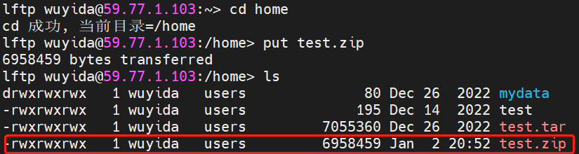
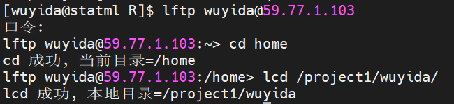
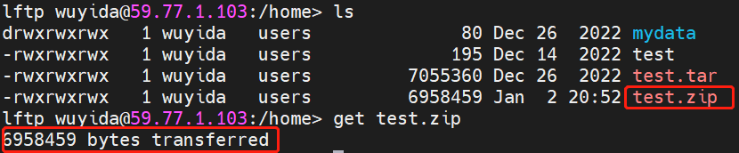

# 1 和NAS云盘文件传输

使用该功能前请先向管理员申请NAS云盘账号，具体见账号创建。

## 1.1 从服务器上传文件至NAS云盘

（1）准备好要上传的文件

如果是要将整个文件夹的文件上传，需要先将文件夹进行压缩，如这里将test文件夹压缩为test.zip。

```
zip -r test.zip /project1/wuyida/R/test

#-r将指定的目录下的所有子目录以及文件一起处理
#test.zip 压缩后的文件名
#/project1/wuyida/R/test 待处理的文件夹绝对路径，如果待压缩的文件夹在当前目录下，直接写文件夹名即可
```

（2）连接NAS云盘账户

```
lftp wuyida@59.77.1.103

#只需要将wuyida修改为你的NAS云盘用户名
```

键入上述命令后需要输入NAS云盘账户密码（没有显示），当显示下图时说明已经成功连接NAS账户。


（3）上传文件至NAS云盘账户

首先进入NAS云盘账户目录，如home目录，然后使用`put 文件名`命令将压缩包上传。
```
cd home

put test.zip
```

当显示下图时说明已经成功将**test.zip**上传至NAS云盘。



（4）使用`quit`退出lftp

（5）浏览器查看NAS云盘内容

在浏览器输入59.77.1.103:4000后输入账号密码可以进入云盘，查看自己账户下的存储内容。

## 1.2 从NAS云盘下载文件至服务器

（1）连接NAS云盘账户后修改本地保存目录

```
lftp wuyida@59.77.1.103

lcd /project1/wuyida/
```


（2）下载文件至刚刚修改的本地目录

使用`get 文件名`命令

```
get test.zip
```

比如把刚刚上传的home目录下的**test.zip**压缩包下载到本地，如图所示。



（3）在服务器解压该压缩包
```
quit #退出lftp

cd /project1/wuyida/

unzip test.zip
```
